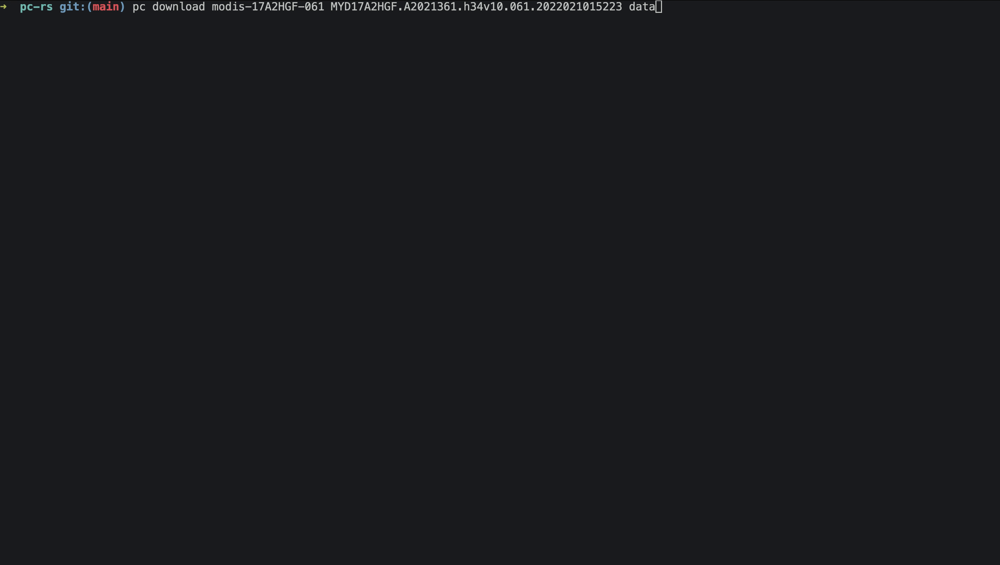

# pc-rs

Download all of the assets from a [Planetary Computer](https://planetarycomputer.microsoft.com/) [STAC](https://stacspec.org/) [Item](https://github.com/radiantearth/stac-spec/blob/master/item-spec/item-spec.md), among other things.



*Note: This is a hobby project maintained by @gadomski, it is not maintained by Microsoft. Please use this repository's issue tracker to request new features or identify bugs; please do not contact Microsoft.*

## Installation

Install rust, e.g. with [rustup](https://rustup.rs/).
Then, install **pc**:

```shell
cargo install --git https://github.com/gadomski/pc-rs
```

## Usage

To download the assets to your current working directory:

```shell
pc download modis-17A2HGF-061 MYD17A2HGF.A2021361.h34v10.061.2022021015223
```

To download to a specific directory:

```shell
pc download modis-17A2HGF-061 MYD17A2HGF.A2021361.h34v10.061.2022021015223 data
```

Use `--help` to see all subcommands:

```shell
$ pc --help
Usage: pc <COMMAND>

Commands:
  download    Download assets from a STAC Item
  collection  Print a STAC Collection to standard output
  item        Print a STAC Item to standard output
  help        Print this message or the help of the given subcommand(s)

Options:
  -h, --help     Print help information
  -V, --version  Print version information
```

## License

**pc-rs** is dual-licensed under both the MIT license and the Apache license (Version 2.0).
See [LICENSE-APACHE](./LICENSE-APACHE) and [LICENSE-MIT](./LICENSE-MIT) for details.
